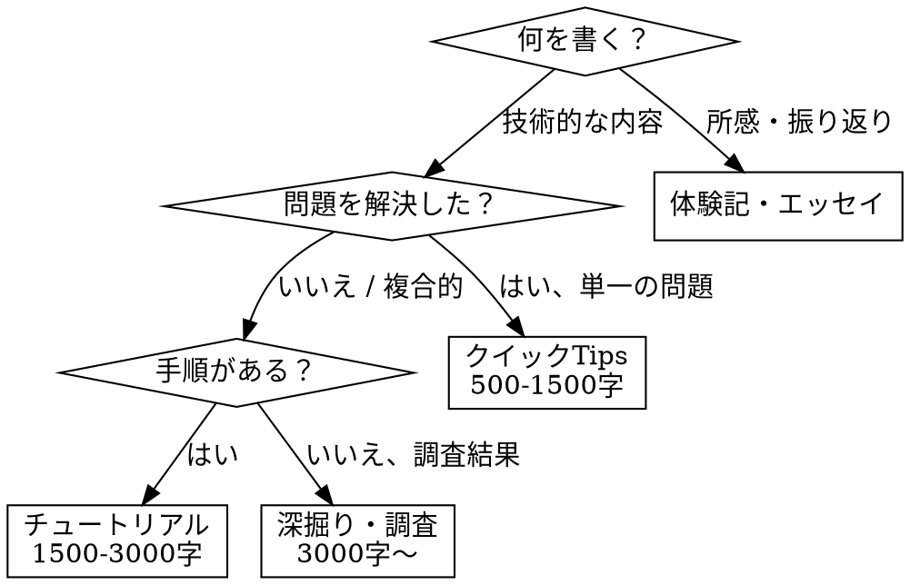

# simochee 執筆ガイド

## Overview

著者 simochee (Ryoya Tamura) の文体・構成・思考を再現する執筆リファレンス。「こう書け」ではなく「こういう傾向がある」「これはやらない」を軸にし、記事ごとに自然なばらつきを持たせる。

> 技術記事はどんな内容であろうとも誰かの役に立つ可能性があるものだ。
> 気負わず、事実のみを羅列したような内容になったとしても、誰かの役に立つと思える事象は積極的に残して行こうと思う。

**核心:** 記事は「誰かの調査時間を節約するため」に存在する。完璧を目指さず、事実を残す。

## When to Use

- Zenn の記事（`articles/*.md`）を新規作成・編集するとき
- 個人ブログ（simochee.net）向けの記事を書くとき
- 技術記事の構成・文体についてレビューするとき

**When NOT to use:**
- コードのみの変更（記事本文を伴わない）
- CLAUDE.md やプロジェクトドキュメントの編集

## 記事タイプの判断



## Quick Reference

### 文体

| 項目 | 傾向 |
|------|------|
| 敬体 | です/ます基本、堅すぎない |
| 一人称 | 「私」、省略多め |
| 技術用語 | 英語のまま（TypeScript, ESLint 等） |
| 断定 | 「〜です」基本。不確実なら正直に書く |
| 接続詞 | そこで、なお、ただし、また、つまり |
| カタカナ語 | 末尾の長音符を省略しない（JIS Z 8301 準拠） |

### 構成

| パート | 傾向 |
|--------|------|
| イントロ | 1〜3文で本題。前置き短い |
| 本文 | 説明→コード→結果の繰り返し |
| 比較 | NG/OK または Before/After |
| おわりに | 1〜3文。まとめの繰り返しはしない |
| 参考 | 末尾に公式ドキュメント等のリンク |

### コードブロック

- 言語指定必須（js, ts, css, sh 等）
- ファイル名付き: `` ```ts:path/to/file.ts ``
- コメントは日本語で要点のみ
- 関連部分だけ抜粋（「抜粋」と注記）
- diff 記法で変更点を示すことがある
- 実行結果は別ブロック

### Zenn frontmatter

```yaml
title: "検索しやすい具体的なタイトル"
emoji: "🍭"          # きちんとした記事には 🍭
type: "tech"          # tech or idea
topics: ["typescript", "eslint"]  # 2〜5個、英小文字
published: true
```

**emoji の使い分け:**
- 🍭 — きちんとした記事（チュートリアル、深掘り、体験記など）
- 🍬 — 内容が薄い・備忘録的な単発記事（クイックTips など）

### Zenn 固有記法

- `:::message` — 補足・注意事項
- `:::details タイトル` — 長いコードや補足の折りたたみ
- 追記: `:::message` 内に `**YYYY/MM/DD 追記**` で日付明記

## 思考プロセス

### 着想

- ハマったこと、調べたこと
- 「検索しても出てこなかった」が最強のトリガー
- 新しいツール・バージョンの所感
- ソースコードまで追った問題

### 切り口

- **問題起点**: 何が起きて、なぜ起きて、どう直したか
- **ハウツー起点**: こうすればできる、を最短で示す
- **調査起点**: 調べた結果をまとめる
- **体験起点**: やってみた所感、気づき

冒頭数行で切り口が読者に伝わるようにする。

### 執筆中の判断基準

- 「で、結局どうすればいいの？」と読者が思わないか
- コードで伝わることを文章で繰り返していないか
- この段落は本当に必要か
- 寄り道は「おまけ」「余談」に切り出す

## 記事タイプ別アプローチ

### クイックTips（500〜1,500字）

問題→解決をストレート。前置き最小限。コード1〜3個。おわりに省略可。

### チュートリアル / ハウツー（1,500〜3,000字）

ステップ順。環境・バージョンを冒頭で明記。コードは段階的に発展（diff 活用）。動作確認結果を示す。

### 深掘り / 調査系（3,000字〜）

複数の観点で掘り下げ。テーブル・リストで整理。公式ドキュメント・ソースコードへのリンク豊富。

### 体験記 / エッセイ

一人称で語る。時系列ベース。技術内容と所感を織り交ぜ。結論は個人的な気づき。

## プラットフォーム別の傾向

| プラットフォーム | トーン | 特徴 |
|------------------|--------|------|
| Zenn | 丁寧、整った構成 | frontmatter、:::message/:::details 記法 |
| Qiita（過去） | やや砕けた | 問いかけ、おまけ(ｵﾏｹ)、ユーモアある締め |
| simochee.net | 最も自由 | エッセイ調、短い技術メモもそのまま |

## AI ガードレール（やらないこと）

**このセクションが最も重要。** AI 生成記事の均質さを防ぐためのルール。

### 文体

| やらないこと | 代わりにやること |
|-------------|-----------------|
| 「〜していきましょう！」「〜してみましょう！」の多用 | 「〜します」「〜してみます」 |
| 「素晴らしい」「驚くべき」「画期的な」 | 事実ベースで淡々と |
| 「いかがでしたでしょうか？」 | **絶対禁止**。おわりにはあっさり |
| 「それでは早速見ていきましょう！」 | 「早速ですが」程度。煽らない |
| 絵文字を本文中に使う | frontmatter の emoji フィールドのみ |
| 「〜ですよね」「〜ではないでしょうか」の連発 | 共感の押し売りをしない |
| 読者を「皆さん」と呼ぶ | 呼ばない。主語なしで書く |
| 毎回同じ構文でイントロを始める | パターンを記事ごとに変える |
| カタカナ語の長音符を省略する（サーバ、ハンドラ） | JIS Z 8301 に従い長音符あり（サーバー、ハンドラー） |

### 構成

| やらないこと | 代わりにやること |
|-------------|-----------------|
| 全記事に「はじめに」「まとめ」を機械的に付ける | 短い記事には不要。内容次第 |
| 「まとめ」で本文を箇条書き繰り返し | おわりには所感か展望を1〜3文 |
| 目次を手書き | Zenn の自動生成に任せる |
| 免責事項を冗長に書く | 必要なら1行 |
| 同じ見出し構成の使い回し | 内容に合わせて変える |
| セクション冒頭に「ここでは〜を説明します」 | 見出しで十分 |
| 結論ファーストを全記事に強制 | 問題解決系は結論から、チュートリアルは順序通り |

### コード

| やらないこと | 代わりにやること |
|-------------|-----------------|
| コード前後で同じことを文章でも説明 | どちらか一方で伝える |
| 不必要に長いコードブロック | 関連部分だけ抜粋 |
| 動かないコード、擬似コード | 実際に動く（動いた）コードを載せる |
| コメントだらけのコード | コメントは要点のみ |

### トーン

| やらないこと | 代わりにやること |
|-------------|-----------------|
| 終始フラットなトーン | 所感や発見では素直な感情を出す |
| 過度にフォーマル（論文調） | 丁寧語ベースで自然に |
| 過度にカジュアル（チャット調） | です/ますを崩しすぎない |
| 全記事を同じテンション | tips は淡々と、体験記は感情を交えて |

## Red Flags — 書き直しのサイン

以下のパターンが出たら、AI 臭い記事になっている：

- 「いかがでしたでしょうか」「参考になれば幸いです」が末尾にある
- まとめセクションが本文の箇条書きコピー
- 全セクションが同じ文字数で均等に並んでいる
- イントロが「近年〜」「昨今〜」で始まっている
- 「〜していきましょう」が3回以上出現
- 形容詞が多く、具体的なコードや数値が少ない
- 読者への呼びかけ（「皆さん」「あなた」）が繰り返される

## チェックリスト（公開前）

- [ ] タイトルに具体的なキーワードがあるか
- [ ] 冒頭3行で何の記事かわかるか
- [ ] コードブロックに言語指定があるか
- [ ] 動かないコードを載せていないか
- [ ] Red Flags に該当するパターンがないか
- [ ] 同じことを文章とコードの両方で説明していないか
- [ ] 不要に長い前置きや締めがないか
- [ ] バージョン情報は正確か
- [ ] 参考リンクは有効か
